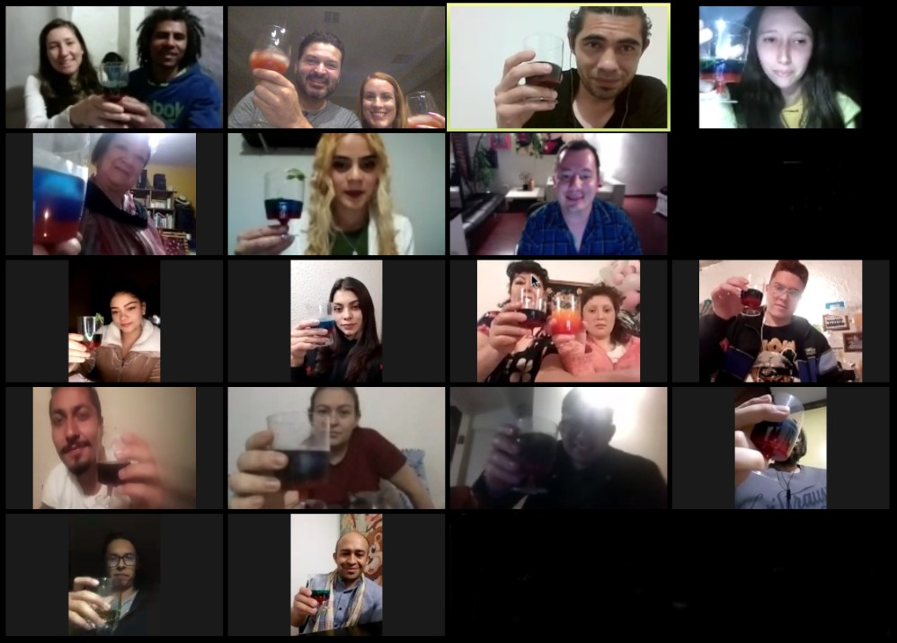

Hoy fue un día para celebrar nuestra unión como equipo y recordar a tantas personas que sufren actualmente por Covid-19 y las secuelas que ha dejado.

Todo comenzo con una pregunta: cómo hacemos para agradecerle al equipo por tanto talento? rapidamente pensamos.. 

Al día siguiente Charly se reunio con su primo y buen amigo ### para idear un cocktail novedos y sobre todo que tuviera el alma de día cero.....

El siguiente día fue un desafio ya que teniamos que comprar tarritos, cajas, hacer la carta.....

El día de entrega comenzo desde las 5:30am cuando mi despertador sono, el plan era salir a las 6:30am para recorrer Bogotá y sus alrededores. Pues personas del equipo vivien en Cota, Suba....

Finalmente nos reunimos por zoom y las cosas no pudieron salir mejor. El equipo esta tan enamorado de este proyecto......

Preparación cocktail día cero:

### Ingredientes

| Cantidad | Ingrediente                            |
| :----- | :--------------------------------------- |
| 1      | Copa de Vodka                            |
| 1      | Cerezas licuadas                         |
| 2      | Hojas de menta (hierbabuena)             |
| 1      | Hielo                                    |

[Miralo en Pinterest](https://dfsd.com)

### Preparación

1. Usa una Copa
2. ....
